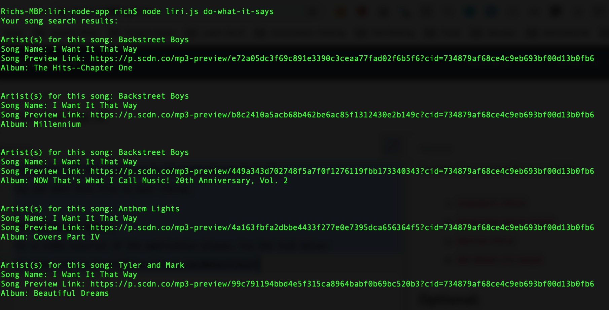

# LIRI Bot Node App

This is a CLI tool that will assist in doing the following basic searches:

1. Search on Bands In Town for a band and list any upcoming events
1. Search on Spotify for a specific song
1. Search on the Open Movies Database for a specific movie.

## Instructions:

1. Clone repo.

1. Add .env file in the root directory with your spotify API keys like this:

```
SPOTIFY_ID=<spotify id>
SPOTIFY_SECRET=<spotify secret>
```
1. Install node package dependencies (if using npm: npm install)

1. Run the tool with the following command:
node liri.js <command> <query>

the following commands are available:
1. `concert-this`
1. `spotify-this-song`
1. `movie-this`
1. `do-what-it-says`

### Optional:
There is a do-what-it-says command feature. This feature will automatically read the random.txt file and execute the command search in it.
You can edit this file to your liking.

### Additional Notes:
For a video tutorial of the application please, try the link below:
[Youtube Link to Demo](https://youtu.be/BQ64yTZjKIQ)

##### Screenshots:

1. concert-this Garth Brooks


1. spotify-this-song Home


1. movie-this shawshank redemption


1. do-what-it-says


1. spotify-this-song


1. movie-this

